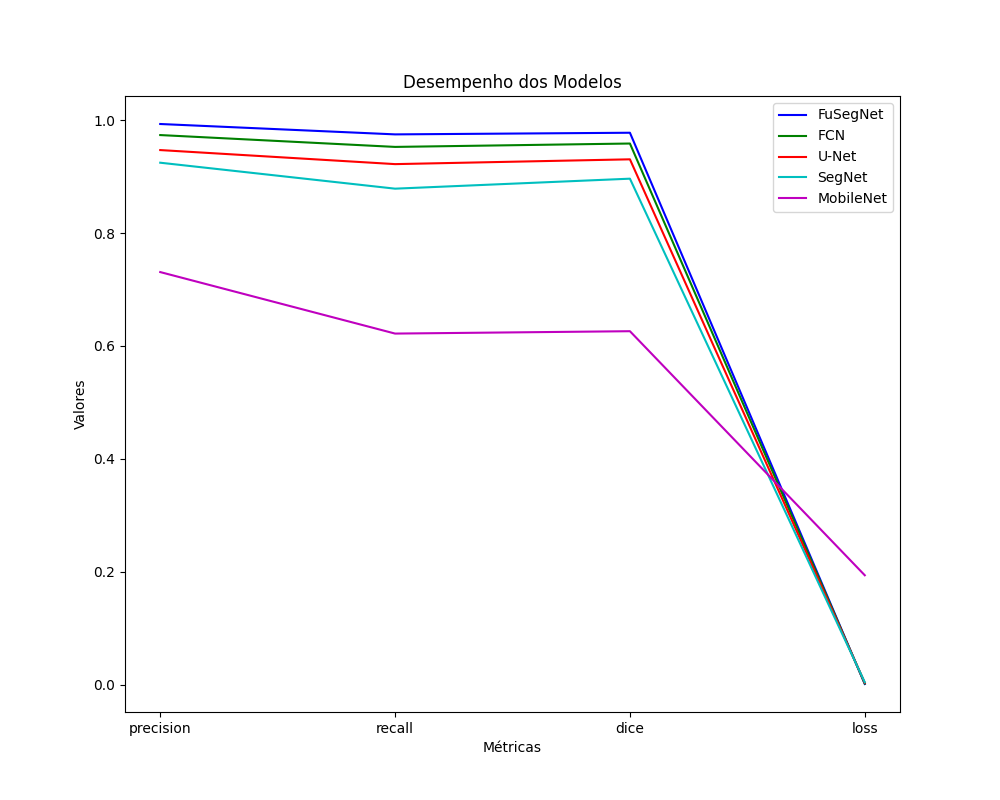

# Comparacao_de_Modelos_de_Machine_Learning_para_Segmentacao_de_Feridas_Malignas_em_Imagens_Medicas

Este Estudo foi desenvolvido para o Trabalho de Conclusão de Curso do curso de Ciência da Computação da Universidade Católica de Pernambuco. O sistema foi desenvolvido para auxiliar o processo de segmentação de imagens medicas de feridas malignas, que é um processo manual e demorado que pode ate ser subjetivo levando ate a erros medicos.


## Tecnologias utilizadas

- Python
- OpenCV
- Scikit-learn
- Scikit-image
- Numpy
- Matplotlib
- Pandas
- Keras
- Tensorflow

para baixar as dependências do projeto, basta executar o comando:

```bash
pip install -r requirements.txt
```

## Como executar o projeto

O projeto foi desenvolvido utilizando o Jupyter Notebook, fizemos uma organização dos arquivos em pastas, para facilitar a execução do projeto. todos os arquivos de execução estão na pasta "scripts".

- Tranamento:  Para executar o treinamento dos modelos, basta executar o arquivo "train.ipynb" que esta na pasta "scripts/train.ipynb". Este arquivo ira treinar os modelos e salvar os pesos dos modelos treinados junto com o gráfico do treinamento e o json com os valores das métricas obtidas na pasta "woundSegmentation/results/(nome do modelo)/training_history, também dentro da pasta do modelo treinado o notebook ira salvar o arquivo do summary do modelo treinado junto com o tempo de treinamento do modelo, todos 2 em txt.

- Predição: Para executar a predição dos modelos, basta executar o arquivo "predict.ipynb" que esta na pasta "scripts/predict.ipynb". Este arquivo ira carregar os pesos dos modelos treinados e ira executar a predição das imagens de teste, salvando as imagens de predição na pasta "woundSegmentation/results/(nome do modelo)/datapredict. O notebook também ira salvar o json com o tempo de predição na pasta "woundSegmentation/results/(nome do modelo)/training_history.

- Geração do gráfico comparativo das métricas dos modelos: Para gerar o gráfico comparativo dos modelos, basta executar o arquivo "generate_results_metrics.ipynb" que esta na pasta "scripts/generate_results_metrics.ipynb". Este arquivo ira gerar o gráfico comparativo das métricas dos modelos e salvar o gráfico na pasta "data/imgs". Para gerar o gráfico foi antecipadamente feito um csv com os valores das métricas de cada modelo, este csv esta na pasta "data/".

## Dataset

O dataset utilizado neste estudo foi criado a partir de um conjunto de dataset de feridas e lesões medias de diferentes cenários. O dataset foi dividido em 2 pastas, sendo elas: "wooundSegmentation/data/(Nome do dataset)/train e woundSegmentation/data/(Nome do dataset)/test". A pasta "train" contem as imagens de treinamento e a pasta "test" contem as imagens de teste. Dentro de cada pasta temos 2 pastas, sendo elas: "images" e "labels". A pasta "images" contem as imagens de treinamento e a pasta "labels" contem as imagens de mascara das imagens de treinamento. As imagens de mascara foram criadas utilizando o software de anotação de imagens "LabelImg". Para criar as imagens de mascara, foi feito a anotação das imagens de treinamento, sendo anotado apenas a região da ferida. O link para acessa a origem do datasets utilizados neste estudo esta na pasta do dataset.

## Gráficos e tabelas

- Gráfico comparativo das métricas dos modelos:



- Tabela comparativa da segmentação dos modelos:


